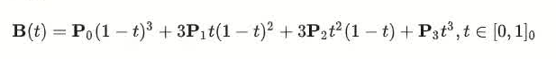

# B-spline_demo
## introduction
This project aims to help learning about B-spline Math, LBFGS optimizer using, writing cost function in evaluate() function
Whole program is built via ros2 rclcpp package
Made by Teemty during intership @Fastlab and thanks HolyQwQ for instructions.

## code structure
B-spline_demo/  
├── demo_ws/  
│   ├── src/  
│   │   ├── cpp_bs_demo/  
│   │   │   ├── launch/  
│   │   │   │   └── bs_demo.launch.py  
│   │   │   ├── rviz/  
│   │   │   │   └── demo.rviz  
│   │   │   ├── urdf/  
│   │   │   │   └── ball_obstacle.urdf  
│   │   │   ├── src/  
│   │   │   │   ├── lbfgs.hpp  
│   │   │   │   ├── optimizer.hpp  
│   │   │   │   ├── publisher.cpp  
│   │   │   │   └── spline.hpp  
│   │   │   ├── CMakeLists.txt  
│   │   │   └── package.xml  
│   │   └── cpp_bs_demo_interface/  
│   │       ├── msg/  
│   │       │   └── trajectory.msg  
│   │       ├── CMakeLists.txt  
│   │       └── package.xml  
├── CMakeLists.txt  
├── Makefile  
└── README.md  
  
## Math of B-spline
1.1 Introduction to Bezer Spline  
https://zhuanlan.zhihu.com/p/688186803  
1.1.1 Definition (e3)  
1) General formula  

2) Normalization Process of domain  

1.1.2 Property  
1) N+1 control points -> N convexity  
2) Convex hull: enclosed by the minimum number of convex polygons  
3) 变差减少性  

4) 仿射不变性: stability in 仿射变换  
5) 递归性  

1.2 Control points' effect on spline  
1.2.1 New equation generation  

1.3 De Casteljau Method 
Teemty will update in the future if the project involves them.  
-> Using parameter u to find out point C(u)  
1.4 Derivative of B-Spline  
Teemty will update in the future if the project involves them.  

## Program Deploying
### environment
Ubuntu 24.04 LTS 
ROS2 jazzy  
Python 3.12  
Eigen 3.4.0  

### launching
cd B-spline-demo/demo_ws/  
colcon build  
source /opt/ros/jazzy/setup.bash  
source install/setup.bash  
ros2 launch cpp_bs_demo bs_demo.launch.py  

##Results

